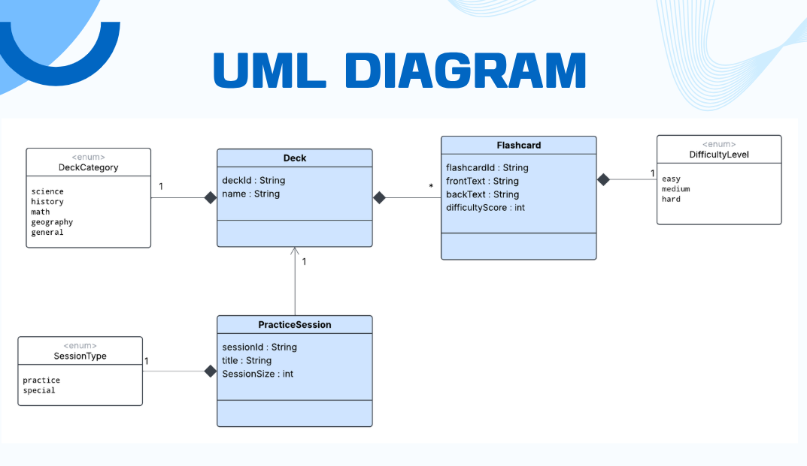
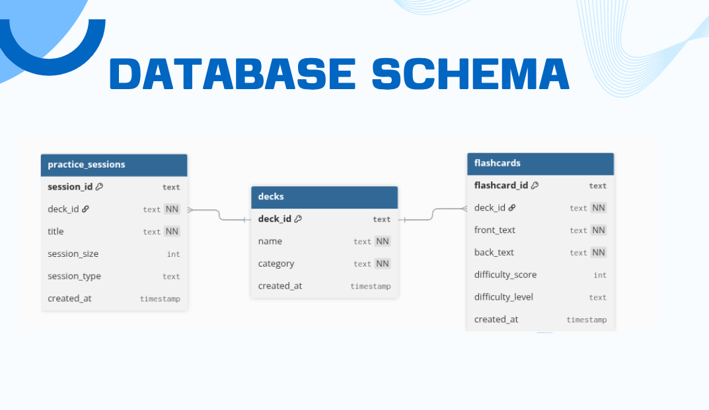
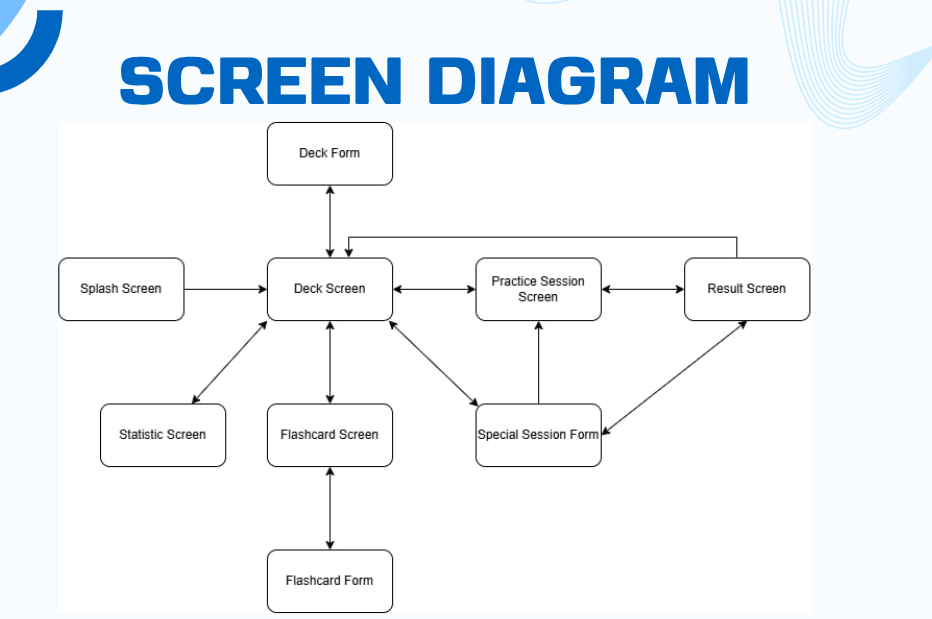

# Cardify
(Ronan the best flutter lecturer)

## Project Overview

Cardify is an offline flashcard learning mobile application built with Flutter, designed to help students and learners memorize information effectively through spaced repetition. The app features an intelligent difficulty system that adapts to user performance, making learning more efficient and personalized.

## Features

### Deck Management
- Create custom flashcard decks organized by category (Science, History, Math, Geography, General)
- Edit existing deck information
- Delete decks that are no longer needed
- View all flashcards within a deck

### Flashcard Management
- Add new flashcards with front and back text
- Edit existing flashcard content
- Delete individual flashcards
- Track difficulty score (0-10 scale) for each flashcard
- Automatic difficulty level classification (Easy, Medium, Hard)

### Practice Sessions
- **Practice Mode**: Study all flashcards in a deck with adaptive repetition
- **Special Mode**: Create custom practice sessions with specific flashcards
- Track answers (Know/Don't Know) during practice
- Automatic difficulty adjustment based on performance
  - "Know" decreases difficulty score
  - "Don't Know" increases difficulty score
- Smart difficulty scoring with 0-10 clamping to prevent overflow
- View practice results with statistics

### Session Analytics
- View practice session history
- Monitor learning progress over time
- Track total sessions and flashcard counts
- Review recent practice sessions
- Statistics dashboard with performance insights

## Diagrams

### Class Diagram - Domain Models


The class diagram shows the relationships between core domain models:
- **Flashcard** with difficulty scoring system (0-10 scale) and automatic difficulty level classification
- **DifficultyLevel** enum with repetition multipliers (easy=1x, medium=3x, hard=5x)
- **Deck** with category classification for organization
- **DeckCategory** enum for deck categorization (Science, History, Math, Geography, General)
- **PracticeSession** tracking individual practice sessions
- **SessionType** enum for practice modes (practice, special)

### Database Schema


Three main tables:
- **decks** - Stores deck information and categories
- **flashcards** - Stores all flashcard data with difficulty tracking
- **practice_sessions** - Logs all practice sessions with metadata and audit trail

### Screen Diagram


The app uses a bottom navigation structure with:
- **Deck screen** - Main dashboard showing all decks by category
- **Add/Edit deck screen** - Create or modify deck information
- **Flashcard screen** - View and manage flashcards within a deck
- **Add/Edit flashcard screen** - Create or modify flashcard content
- **Practice session screen** - Interactive study mode with Know/Don't Know buttons
- **Result screen** - Practice session summary with statistics
- **Statistics screen** - Overall progress tracking and session history

## Technical Implementation

### Difficulty System
The app uses an intelligent difficulty scoring system:
- **Score Range**: 0 (easiest) to 10 (hardest)
- **Difficulty Levels**:
  - Easy: score ≤ 2 (1x repetition multiplier)
  - Medium: score = 3 (3x repetition multiplier)
  - Hard: score > 3 (5x repetition multiplier)
- **Auto-clamping**: Scores are automatically clamped between 0-10 to maintain data integrity
- **Dynamic Updates**: Difficulty level updates in real-time during practice sessions

### Architecture
The app follows Clean Architecture principles with clear separation of concerns:
- **Models**: Core domain entities (Flashcard, Deck, PracticeSession)
- **Repository Pattern**: Data access layer for database operations
- **Database**: SQLite for offline data persistence
- **UI Layer**: Flutter widgets organized by feature

### Core Models

#### Flashcard
- `flashcardId`: Unique identifier
- `deckId`: Reference to parent deck
- `frontText`: Question or prompt
- `backText`: Answer or explanation
- `difficultyScore`: Integer (0-10) tracking mastery level
- `difficultyLevel`: Enum (easy, medium, hard) with repetition multipliers

#### Deck
- `deckId`: Unique identifier
- `name`: Deck title
- `category`: Enum categorization
- `flashcards`: List of associated flashcards

#### PracticeSession
- `sessionId`: Unique identifier
- `title`: Session name
- `deckId`: Reference to practiced deck
- `sessionSize`: Number of flashcards in session
- `sessionType`: Enum (practice, special)

## Database Schema

### Tables
- **flashcards**: Stores all flashcard data with difficulty tracking
- **decks**: Stores deck information and categories
- **practice_sessions**: Logs all practice sessions with metadata

## Project Structure

```
lib/
├── models/                      # Domain models
│   ├── flashcard.dart          # Flashcard entity with difficulty system
│   ├── deck.dart               # Deck entity with category enum
│   └── practice_session.dart   # Practice session tracking
│
├── data/
│   ├── database/               # Database layer
│   │   ├── database_helper.dart   # SQLite database configuration
│   │   └── database_seed.dart     # Initial data seeding
│   │
│   └── repository/             # Data access layer
│       ├── flashcard_repository.dart   # Flashcard CRUD operations
│       ├── deck_repository.dart        # Deck CRUD operations
│       └── practice_repository.dart    # Practice session operations
│
├── ui/
│   ├── screens/                # Main application screens
│   │   ├── deck_screen.dart           # Main deck list view
│   │   ├── flashcard_screen.dart      # Flashcard list view
│   │   ├── practice_session_screen.dart  # Practice mode
│   │   ├── result_screen.dart         # Session results
│   │   ├── statistics_screen.dart     # Analytics dashboard
│   │   └── splash_screen.dart         # App loading screen
│   │
│   └── widgets/                # Reusable UI components
│       ├── deck/               # Deck-related widgets
│       │   ├── deck_item.dart
│       │   └── deck_form.dart
│       ├── flashcard/          # Flashcard-related widgets
│       │   ├── flashcard_item.dart
│       │   └── flashcard_form.dart
│       ├── practice/           # Practice session widgets
│       │   ├── practice_item.dart
│       │   ├── result_item.dart
│       │   └── special_session_form.dart
│       ├── statistics/         # Statistics widgets
│       │   ├── statistic_item.dart
│       │   └── recent_item.dart
│       └── button/             # Common button widgets
│           ├── add_button.dart
│           └── session_button.dart
│
└── main.dart                   # Application entry point

test/                           # Unit tests
├── models/                     # Model tests
│   ├── flashcard_test.dart    # Flashcard model tests
│   ├── deck_test.dart         # Deck model tests
│   └── practice_session_test.dart
│
└── repository/                 # Repository tests
    └── flashcard_repository_test.dart  # Difficulty calculation tests
```

## Key Features Implementation

### Adaptive Learning
- Difficulty scores adjust automatically based on user responses
- Repetition multipliers ensure harder cards appear more frequently
- Clamped scoring prevents unrealistic difficulty levels

### Offline-First
- All data stored locally using SQLite
- No internet connection required
- Instant performance and reliability

### Simple UX
- Intuitive navigation with bottom navigation bar
- Clear visual feedback during practice
- Easy deck and flashcard management

## Testing

The project includes comprehensive unit tests:
- Model tests for data integrity
- Repository tests for database operations
- Difficulty calculation tests including edge cases
- Score clamping validation tests

## Contributors
Chea Ilong and Kosal Sophanith
